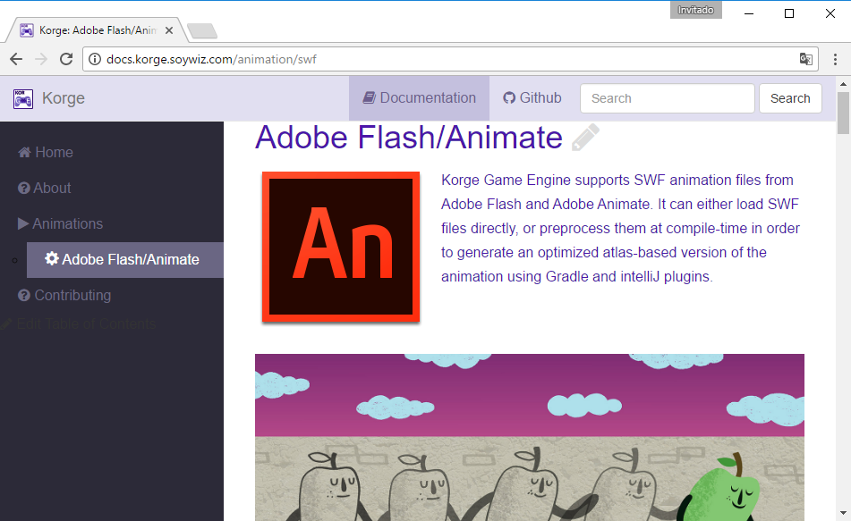

# KorGE: Kotlin cORoutines Game Engine

[](https://travis-ci.org/korlibs/korge)

[](https://gitter.im/korge-game-engine/Lobby)


[All Soywiz's KORLIBS](https://github.com/soywiz/korlibs)

## Documentation:

[](http://docs.korge.soywiz.com/)

### Compiling:

Add to `$HOME/.gradle/gradle.properties` this line (since this project includes intellij plugin + gradle plugin requires a lot of memory to work):
```
org.gradle.jvmargs=-Xmx2048m -XX:MaxPermSize=512m -XX:+HeapDumpOnOutOfMemoryError -Dfile.encoding=UTF-8
```

Building:
```
./gradlew build
```

Run intelliJ IDE with the plugin installed:
```
./gradlew runIde
```

### Modern, portable, testable and enjoyable Game Engine for Kotlin

Check [korge-sample](https://github.com/soywiz/korge/tree/master/korge-sample) folder for looking actual code.

Korge works with Korio, Korim, Korma, Korag, Korau and Korui and it is really portable. It is designed to work with JTransc
and will work with pure Kotlin targets as they support reflection and multi-target projects arises.

It provides a flash-like optimized Views 2d scene tree. (3d will be supported in future versions)

It has a ResourceRoot, that is a mountable virtualfilesystem for accessing resources. You can asynchronously load resources at any time.

Along Korio also allows to develop websockets applications (doing fullstack using kotlin and sharing code).
And Korge allows you to run server/client in the same run and debug. Check [korge-kingdom](https://github.com/soywiz/korge-kingdom).

It can operate headless, so it is travis friendly, and allows testing actual game scenes (controllers) with great utility functions.

It features scenes and asynchronous dependency injection. It is completely asynchronous including resource loading, so doesn't require preloading all assets.

It allows to load Adobe Flash/Adobe Animate SWF files directly (including instantiating library elements and accessing elements by name) generating atlas with shapes.
Or preprocess at compilation them generating ANI files (simpler + atlas-based) animations that will load quickly on low-end devices.

It allows to render vector graphics using platform-specific libraries transparently.

It features tweens with easings.

It features components attached to views acting as decorators.
Decorators/Components are usually declared smoothly as extension methods.
Supports docking and different scaling strategies.
Allows to adjust speed per view.
Leak-free design.

Using Korma allows to operate with non trivial polygons and vectors, including triangulation and TRA* pathfinding.

It supports tiled tilemaps out of the box.
It supports Spriter libraries and skeletons.

It supports Bitmap fonts and device fonts. Supports automatical bitmap font generation from device fonts.
Also supports simple HTML rendering.

Supported platforms:
* JVM support
* Android support
* JavaScript support

Planned features:
* Particle support
* Spine support
* Adobe AIR support using JTransc (korag will be implemented using Stage3D)
* iOS with Adobe AIR (and later with plain C++)

Example:

```
class Sample1Scene(
	@Path("korge.png") val korgeTex: Texture,
	@Path("simple.swf") val swfLibrary: AnLibrary,
	@Path("test1.swf") val test1Library: AnLibrary,
	@Path("test4.swf") val test4Library: AnLibrary,
	@Path("as3test.swf") val as3testLibrary: AnLibrary,
	@Path("soundtest.swf") val soundtestLibrary: AnLibrary,
	@Path("progressbar.swf") val progressbarLibrary: AnLibrary,
	@Path("buttons.swf") val buttonsLibrary: AnLibrary,
	@Path("tiles.png") val tilesetTex: Texture,
	@Path("font/font.fnt") val font: BitmapFont,
	@Path("spriter-sample1/demo.scml") val demoSpriterLibrary: SpriterLibrary,
	@FontDescriptor(face = "Arial", size = 40) val font2: BitmapFont
) : Scene() {
	suspend override fun init() {
		super.init()

		tileset = TileSet(tilesetTex, 32, 32)

		sceneView.container {
			this.tileMap(Bitmap32(8, 8), tileset) {
				this.x = -128.0
				this.y = -128.0
				alpha = 0.8
			}
			this.dockedTo(Anchor.CENTER_CENTER)
		}.mouseSampleController()
	}
}
```
