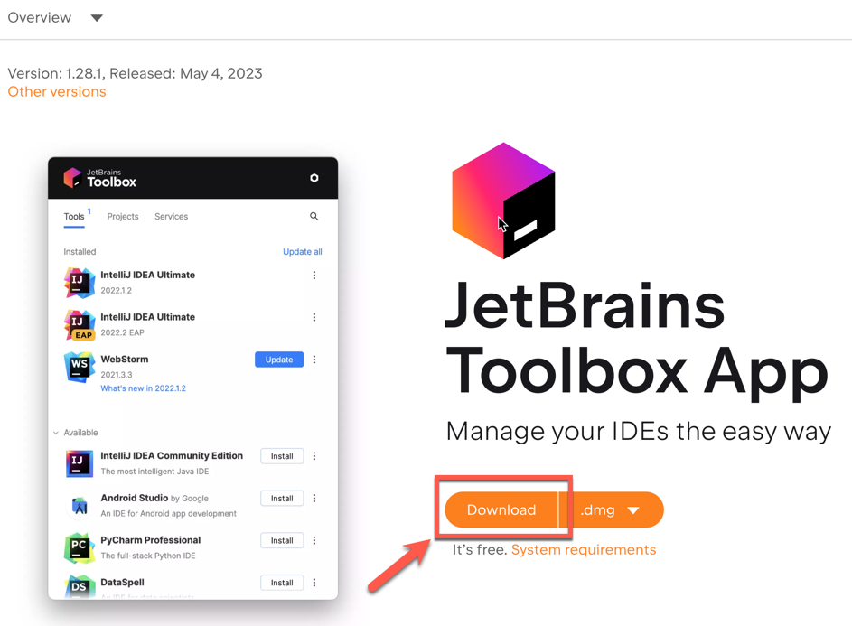
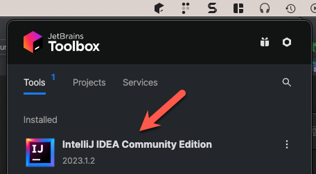
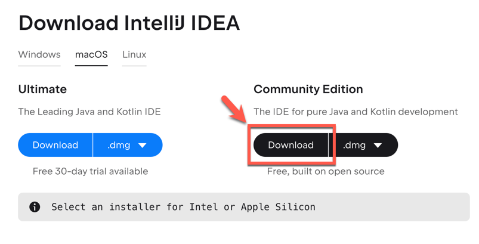
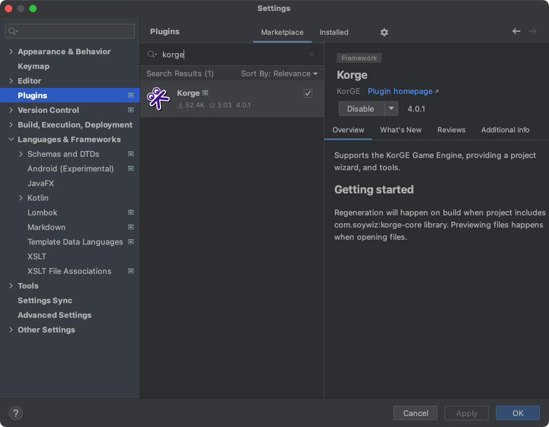
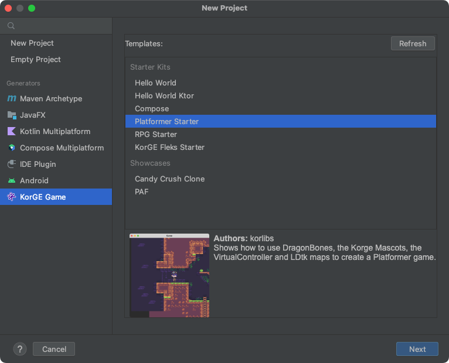
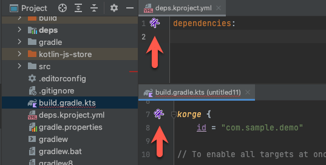
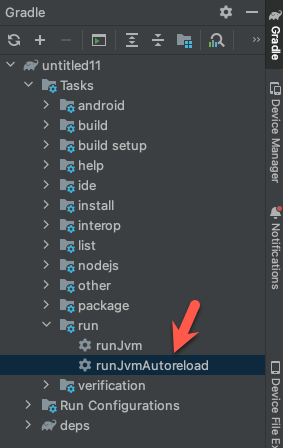



## Welcome to KorGE

**KorGE Game Engine** is an [Open Source](https://github.com/korlibs/korge){:target="_blank"} modern Game Engine created in [Kotlin](https://kotlinlang.org/){:target="_blank"} designed to be extremely portable and really enjoyable to use.
It works on 
**Desktop**,
**Web** and 
**Mobile**. 
It is fully asynchronous, so it is also nice for the web.

It includes libraries for game development and other areas,
an [asset & library store](https://store.korge.org/),
starter kits,
and an [IntellIJ plugin](https://plugins.jetbrains.com/plugin/9676-korge) to improve the workflow.

You can see a small presentation of KorGE here: <https://korge.org/>{:target="_blank"}

## 1. Install IntelliJ IDEA

### Install JetBrains ToolBox

JetBrains ToolBox supports installing and keeping up-to-date all the JetBrains products. It is free.
And supports installing the free IDEs available including IntelliJ IDEA Communit Edition. 

* <https://www.jetbrains.com/toolbox-app/>

### Manually Install IntelliJ IDEA

* <https://www.jetbrains.com/idea/download/> - Community Edition will work, but you can also use the Ultimate edition.

## 2. Install the KorGE **IntelliJ IDEA plugin**:

### Install Button:

You can click here to install the plugin:

<iframe frameborder="none" width="245px" height="48px" src="https://plugins.jetbrains.com/embeddable/install/9676"></iframe>

### Plugin website:

Or download the plugin from the [KorGE Plugin page](https://plugins.jetbrains.com/plugin/9676-korge).

### Plugin settings:

## 3. Create a Project

### Install one of the starter kits or samples available using the `New Project...` Wizard:

You can select one of the `Starter Kits` or one of the `Showcases` with a full game:

## 4. Access the KorGE Store

In order to access some KorGE features, you can install them via the KorGE Store.

You can access that store via: <https://store.korge.org/>

Or inside the IntelliJ Plugin navigation bar:

Or when opening your `build.gradle.kts` or your `deps.kproject.yml`:

## 5. Running your code

When creating a new project a new run configuration `runJvmAutoreload` should be available:

You can also `double click` on the `Gradle` → `Tasks` → `run` → `runJvmAutoreload`
to create a run configuration and execute your program:

## Next Steps

Now that you have a working environment, let's explore other concepts.

1. Take your [first steps](firststeps) learning to create a sample game with basic shapes.
2. Then build a more complex and realistic game with a [step-by-step tutorial to build a 2048 game](/korge/samples/).
3. Finally, [deploy it in one of our supported platforms](/korge/deployment/).

From there you can get a deep look to the [reference documentation](/korge/reference/).

## Asking Questions and Solving Doubts

You can ask questions in:

* [Discord Community](https://discord.korge.org/)
* [Github Discussions](https://github.com/korlibs/korge/discussions)

We have a nice and welcoming community! Feel free to drop in.

## Tools:

KorGE uses intelliJ as IDE + Gradle for building. You can check how to [set-up the environment here](/korge/gettingstarted/setup/).

## Targets:

* You can target JVM Desktop and Android using Kotlin/JVM.
* With JavaScript you can generate Web and PWA applications.
* With Kotlin/Native you can generate native Windows, Linux, macOS executables, as well as native iOS applications.
