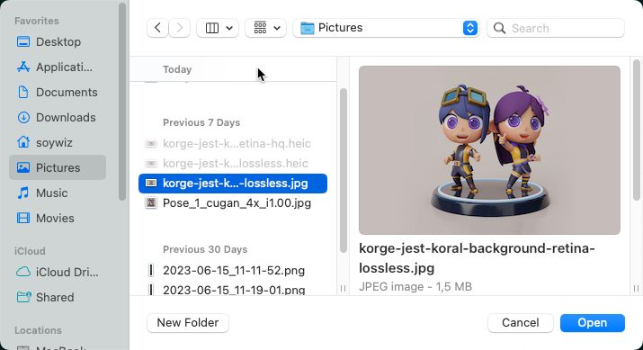

## DialogInterface

### browse

In order to open a URL with the default user Internet Browser:

```kotlin
views.gameWindow.browse("https://korge.org/")
```

### alert/alertError

To display an alert message or exception with a native dialog:

```kotlin
views.gameWindow.alert("My message")
views.gameWindow.alertError(Exception("My error message"))
```


### confirm

To ask the user to confirm an action with a native dialog:

```kotlin
val result: Boolean = views.gameWindow.confirm("My message")
```


### prompt

To ask the user to input a string:

```kotlin
val result: String = views.gameWindow.prompt("My title", "default")
```


### close

This will close the window.

### openFileDialog

To ask the user to select one or more files, for writing or reading.

```kotlin
val selectedFiles: List<VfsFile> = views.gameWindow.openFileDialog(FileFilter("Images" to listOf("*.jpg", "*.jpg")), write = false, multi = true, currentDir = null)
```


