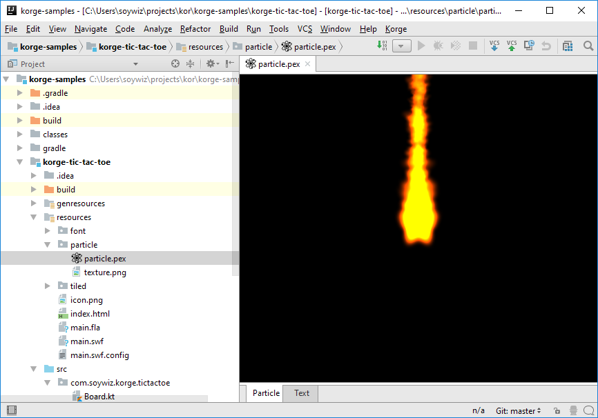

Particle system is compatible with [Starling's one](https://github.com/Gamua/Starling-Extension-Particle-System). Which is compatible with the following editors:

* [71 squared particle designer](https://71squared.com/particledesigner)
* [https://onebyonedesign.com/flash/particleeditor/](https://onebyonedesign.com/flash/particleeditor/)

[Korge's intelliJ plugin](/plugin/intelliJ) allows you to preview particles directly in your IDE.
Just double-click a `.pex` file, and you are done.

