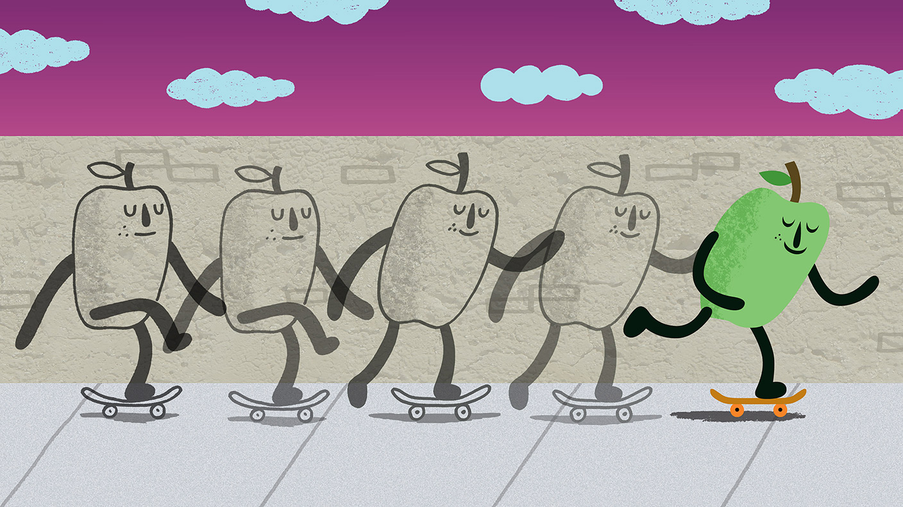
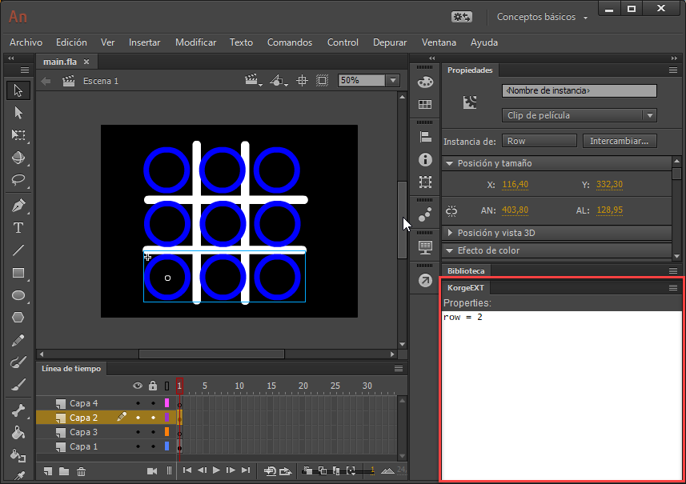
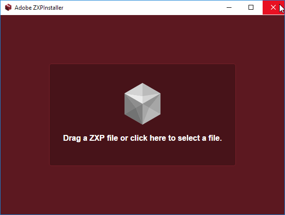
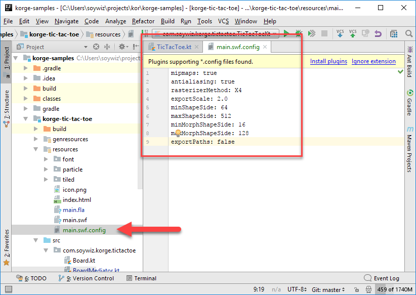
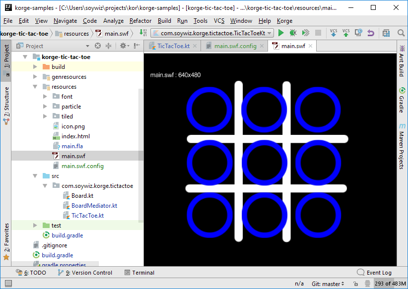
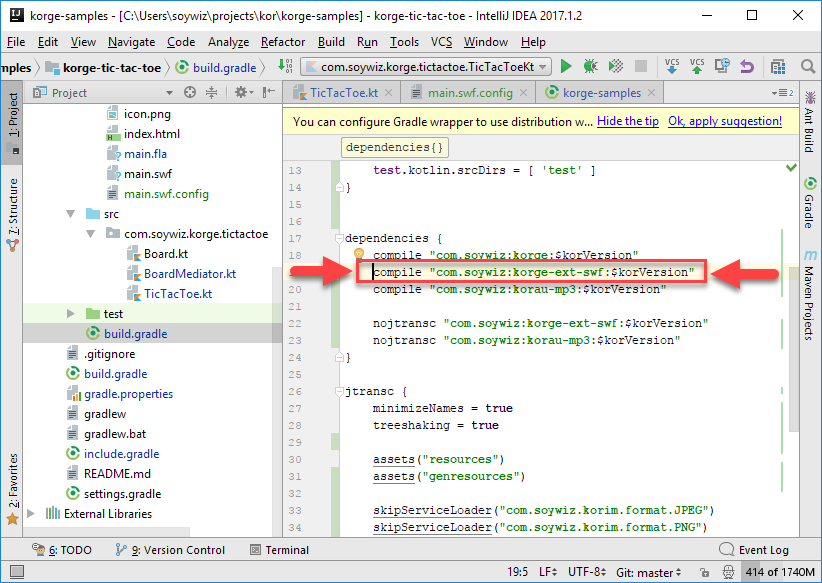
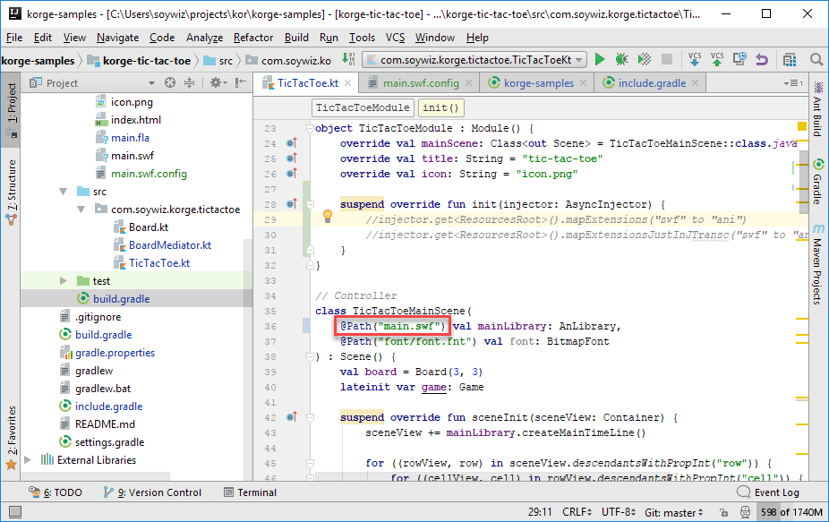
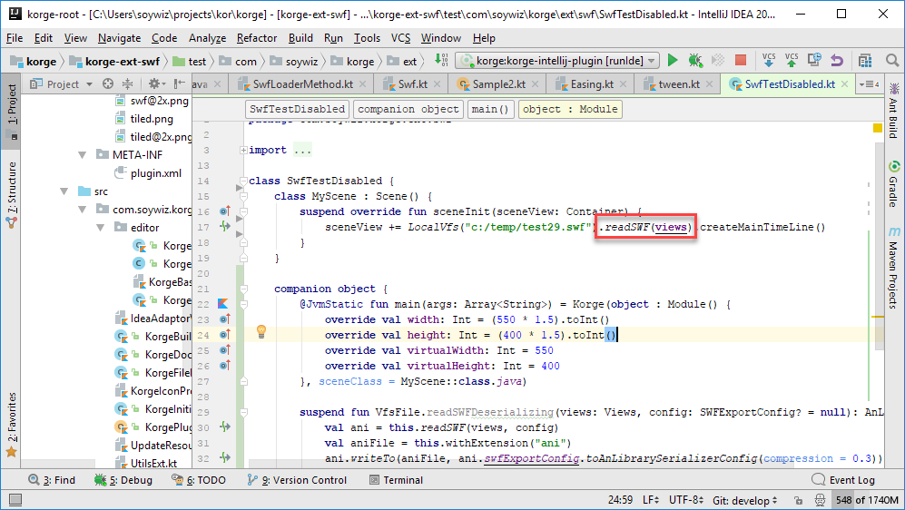

AnLibrary is your common interface to any kind of animation libraries. Either **SWF** files, or **ANI** files. Or any custom animation library you plug-in.

### Basic interface

```
class AnLibrary() {
  val views: Views

  val width: Int
  val height: Int

  val fps: Double
  val msPerFrameDouble: Double
  val msPerFrame: Int
  var bgcolor: Int
  var defaultSmoothing = true

  fun createMainTimeLine(): AnMovieClip
  fun create(name: String): AnElement
  fun createShape(name: String): AnShape
  fun createMovieClip(name: String): AnMovieClip
}
```

## SWF


Korge Game Engine supports SWF animation files from Adobe Flash and Adobe Animate.
It can either load SWF files directly, or preprocess them at compile-time in order
to generate an optimized atlas-based version of the animation using Gradle and intelliJ plugins.

<div style="clear: both;"></div>



### Supported features:

* Symbol exports
* Sounds
* Masks
* Color Transforms
* Texts with HTML + Device fonts
* Blending Modes: NORMAL, ADD, MULTIPLY, SUBTRACT
* 9-patch (scaling-grid)
* Morph Shapes (but won't be as smooth as other transitions)
* Supports AS3 `stop`, `gotoAndPlay` and `gotoAndStop` with constant values for simple flow
* Frame names + Symbol names + Instance names
* KorgeEXT extended properties
* Smoother animations (interpolation between keyframes)
* Direct SWF load at runtime (rasterization handled by KorIM)
* Automatic Compile-time ANI file generation from SWF
* Adjusting speed using `View.speed` property

### Current limitations:

* Can't use AS2 / AS3 (except for `stop`, `gotoAndPlay` and `gotoAndStop` with constant values)
* Some BlendModes won't work
* Text editing
* Stroke scaling won't work due to atlas-bases rendering
* Masks do not antialias for now (it internally uses stencil buffer)
* Filters are not supported yet

## Example and tutorials

* [Tic-tac-toe](https://github.com/soywiz/korge-samples/tree/master/korge-tic-tac-toe)

### Tutorials

Coming soon...

## KorgeEXT: Animate extension for custom properties

Adobe Flash/Animate just allows you to set instance names. But what if you could
set custom properties to access them by code or to trigger behaviours?



KorgeEXT allows you to do exactly that. You can select any instance and define
several properties (a set of key/value pairs or just keys).
For example you can define a level, and set the gravity or physical behaviour of
some instances.

You can use properties in three ways:

* Get/Set properties for a View
* Create a component handler that will be attached to views with that property automatically (for example *disabled* property that will disable mouse interaction)
* Query (*just like jQuery does*) views with specific properties

### Download and install Animate KorgeEXT extension

You can download KorgeEXT extension here:
**[https://github.com/soywiz/korge/raw/master/korge-ext-swf/flash-ext/KorgeEXT-0.0.1.zxp](https://github.com/soywiz/korge/raw/master/korge-ext-swf/flash-ext/KorgeEXT-0.0.1.zxp)**

With Adobe Flash Pro, you can install it with Extension Manager. And for newer versions,
you have to use a custom installer like [ZXP Installer](http://zxpinstaller.com/).

[](http://zxpinstaller.com/)

### Known issues

It is known that when the KorgeEXT panel is opened, triple-click doesn't work.
A workaround until fixed is to close the panel when triple-click is required,
and reopen when you need to set custom properties.

## Adjusting atlas generation and exportation

In order to be able to configure how the atlas is going to be generated, you can
add a `.swf.config` file along your `.swf` file.



```
data class SWFExportConfig(
	val debug: Boolean = false,
	val mipmaps: Boolean = true,
	val antialiasing: Boolean = true,
	val rasterizerMethod: Context2d.ShapeRasterizerMethod = Context2d.ShapeRasterizerMethod.X4,
	val exportScale: Double = 2.0,
	val minShapeSide: Int = 64,
	val maxShapeSide: Int = 512,
	val minMorphShapeSide: Int = 16,
	val maxMorphShapeSide: Int = 128,
	val exportPaths: Boolean = false
)
```

Description:

* **mipmaps**: Creates mipmaps at runtime, so it keeps smooth when scaling down.
* **antialiasing**: Creates smooth vectors. Not antialiasing is faster, but it will have rough edges.
* **rasterizerMethod:**
  * **NONE** - Fastest. Can generate artifacts for compound shapes with comnmon edges. Respects antialiasing.
  * **X1** - Fast. Low quality. In effect same as antialiasing off.
  * **X2** - Super-Samples 2x
  * **X4** *(default)* - Best quality. Super-samples at 4x.
* **exportScale:** scales the contents of the atlas to 2x so it keeps sharp when zooming in.
* **minShapeSide:** This prevents generating shapes too small
* **maxShapeSide:** This prevents generating shapes too big
* **minMorphSide:** This prevents generating morph shapes too small
* **maxMorphSide:** This prevents generating morph shapes too big. *Note:* Morph shapes generate an image in the atlas per ratio. So when used you can adjust this value to prevent the atlas growing too much.
* **exportPaths** Korge allows using shapes for hitTesting, at the cost of bigger ani sizes and slower hittesting.

### Previews & Development cycle

You can preview ANI/SWF files (as they will look in runtime) right in intelliJ, using Korge's intelliJ plugin (*that uses Korge itself for rendering!*):



Korge's gradle plugin will generate `ani` files for you automatically. So you can reference `.ani` files instead of `.swf` files and it will work.

Korge's intelliJ plugin will generate an cache `ani` files when you press *play* or *debug* so you can use them at runtime.

### Loading SWF files at runtime

If you prefer to load SWF files at runtime instead of preprocessed ANI files, you can. You have to add `korge-ext-swf` as compile dependency.



Then you can load it injecting as a dependency to your scene using `@Path("path/to/file.swf")` and `: AnLibrary` type.



If prefer, you can also use the extension method `VfsFile.readSWF(views: Views)` that will load you the `AnLibrary` from an SWF file from any VfsFile.


