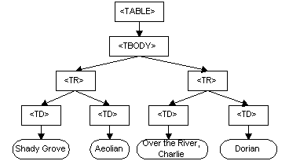
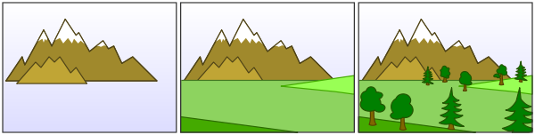
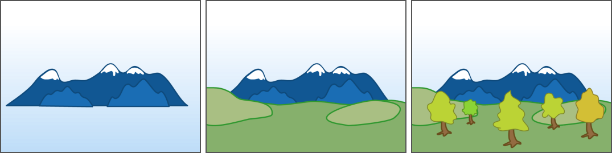

Korge's views works like [AS3's DisplayObject](https://help.adobe.com/en_US/FlashPlatform/reference/actionscript/3/flash/display/DisplayObject.html) or the HTML DOM. It is intended for 2D rendering, though you can create custom views with 3D content rendering with KorAG.



## Video-tutorial



## Rendering



It is **a tree structure** where `View` has a parent, and `Container` has other `View` as children.

Then when **KorAG performs the rendering**, it starts drawing from the bottom to the top. Just like [Painter's Algorithm](https://en.wikipedia.org/wiki/Painter%27s_algorithm).





## Properties

### Basic Properties

* **x, y**
* **scaleX, scaleY**
* **rotation**: [Angle](/korma/#angle)
* **skewX, skewY**
* **visible**
* **alpha**
* **blendingMode**
* **speed**: Double -- controls the view's updating speed (being a ratio where 1 is 1x, 0.5 is 0.5x and 2 is 2x the speed)
* **colorMul**: [RGBA](/korim/#rgba)

### Computed Properties

* **globalX, globalY**
* **globalMatrix**

### Blending Modes

KorGE supports NORMAL, ADD, MULTIPLY and SUBTRACT blending modes.


## Components

Each view might have components attached. Each component is attached to a View.

```kotlin
interface Component {
    val view: View
}
fun <T : Component> T.attach() = this.apply { this.view.addComponent(this) }
fun <T : Component> T.detach() = this.apply { this.view.removeComponent(this) }
```

And there are several kind of `Components` that can hook View's behaviour. You can create components that implement several Component interfaces:

### Handling Updating

```kotlin
interface UpdateComponentWithViews : Component {
    fun update(views: Views, ms: Double)
}

interface UpdateComponent : Component {
    fun update(ms: Double)
}
```

### Handling Resizing

```kotlin
interface ResizeComponent : Component {
    fun resized(views: Views, width: Int, height: Int)
}
```

### Handling Events

```kotlin
interface EventComponent : Component {
    fun onEvent(event: Event)
}
```

### Handling Input Events

```kotlin
interface TouchComponent : Component {
    fun onTouchEvent(views: Views, e: TouchEvent)
}

interface MouseComponent : Component {
    fun onMouseEvent(views: Views, event: MouseEvent)
}

interface KeyComponent : Component {
    fun onKeyEvent(views: Views, event: KeyEvent)
}

interface GamepadComponent : Component {
    fun onGamepadEvent(views: Views, event: GamePadButtonEvent)
    fun onGamepadEvent(views: Views, event: GamePadStickEvent)
    fun onGamepadEvent(views: Views, event: GamePadConnectionEvent)
}
```

The lifecycle of that component is associated to the View. So when the View and the Component are no longer referenced,
they will be collected by the GC.

For example, a Component that would reposition views when the viewport is rezied would be like this:

```kotlin
fun <T : View> T.dockedTo(anchor: Anchor) = DockingComponent(this, anchor).attach()

class DockingComponent(override val view: View, var anchor: Anchor) : ResizeComponent {
	override fun resized(views: Views, width: Int, height: Int) {
		view.x = views.actualVirtualLeft.toDouble() + (views.actualVirtualWidth) * anchor.sx
		view.y = views.actualVirtualTop.toDouble() + (views.actualVirtualHeight) * anchor.sy
		view.invalidate()
		view.parent?.invalidate()
	}
}
```

### Taking a screenshot

Sometimes you will want to take a screenshot, or save a View in a Bitmap, or render the view in a Bitmap. To do so, you can use the `View.renderToBitmap(views)` method.

To save the whole screen:

```kotlin
val bitmap: Bitmap32 = stage.renderToBitmap(stange.views)
```
